# Maven multi-module tutorial

Vengono mostrati i passi necessari per creare un progetto maven multi-modulo con IntelliJ. Il progetto sarà composto da:

- modulo parent (definisce le dipendenze e le configurazioni in comune)
	- modulo core
	- modulo service (dipende dal core) 

#### Creare un nuovo progetto
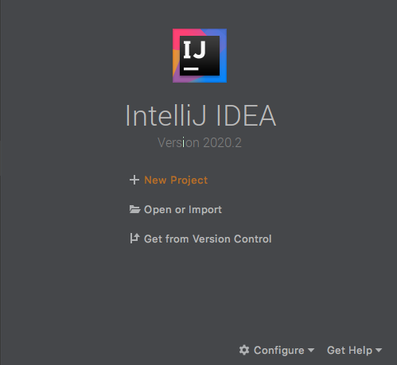

#### Usare Maven (anche senza archetype)
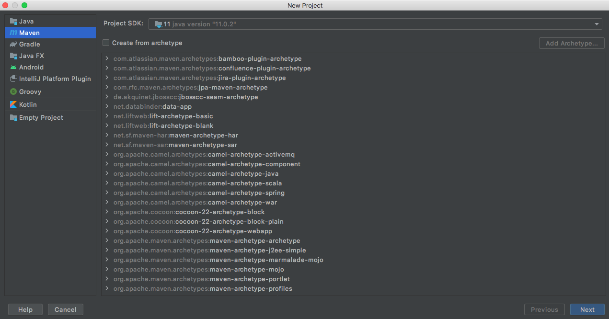
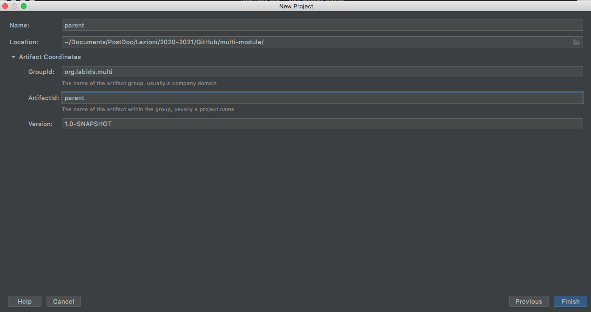

#### Aggiungiamo al pom.xml qualche dipendenza (es. JUnit)
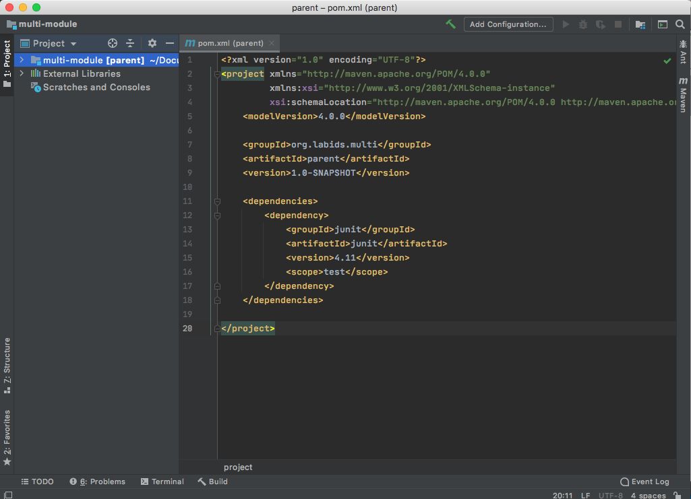

#### Nel modulo parent, creare un nuovo modulo (core)
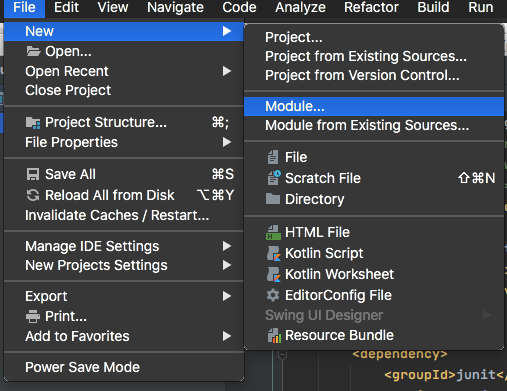
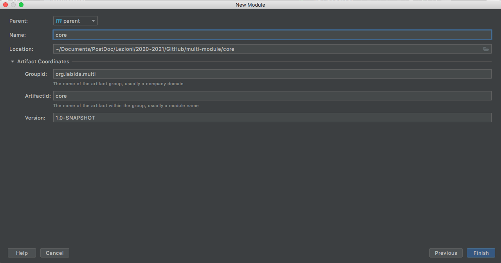

#### In automatico verrà aggiunto al core un riferimento al parent e viceversa
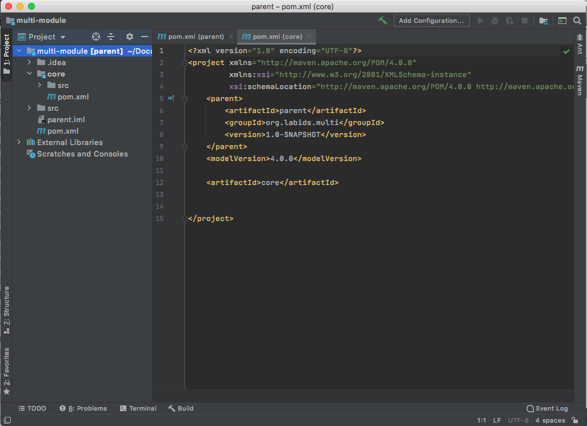
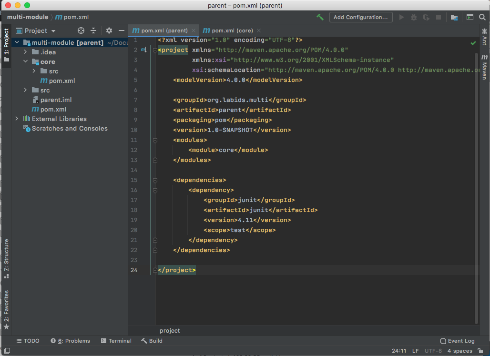

#### Aggiungiamo al parent altre configurazioni in comune tra i sotto-moduli (es. properties)
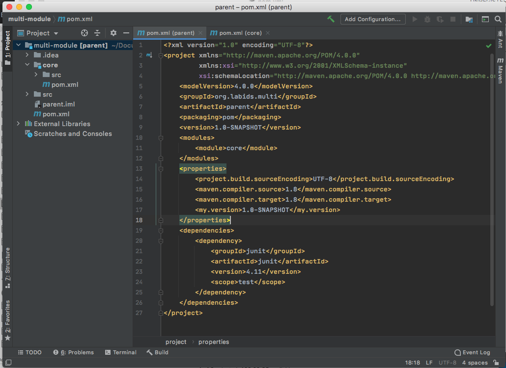

#### Sempre dal parent, creiamo un secondo sotto-modulo (service)
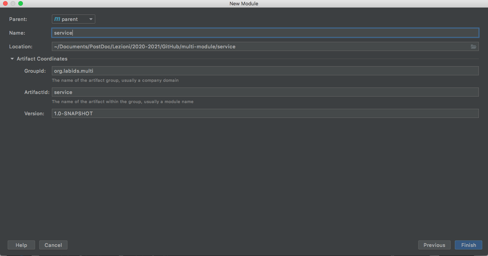

#### Anche questo avrà un riferimento al parent (e viceversa); aggiungiamo una dipendenza esplicita dal modulo core
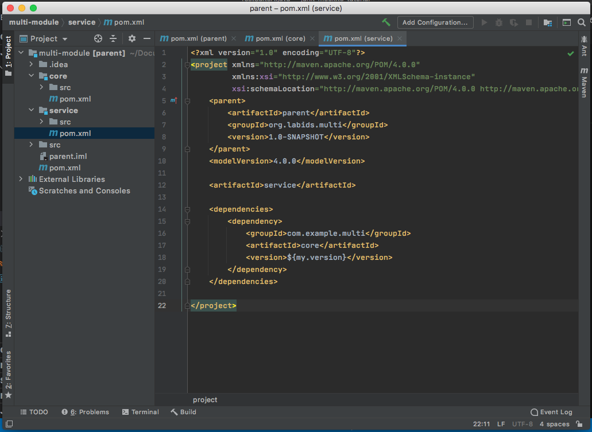

#### Usando mvn install sul parent verranno installati tutti e tre i moduli (in maniera analoga per altri comandi, es. mvn test)
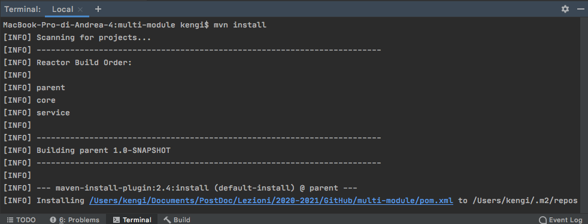
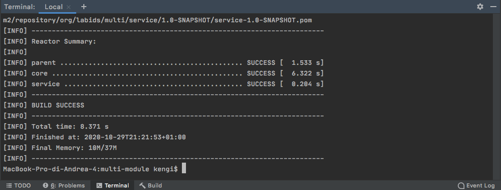